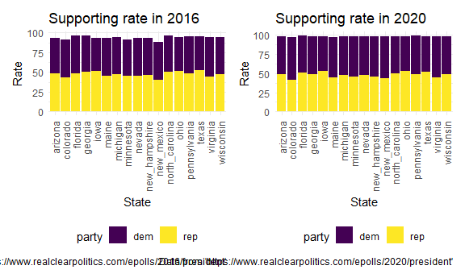

Supporting rate comparison
================

# Compare the supporting rate of dem/rep between 2016 and 2020.

``` r
support2016_df =
  read_csv("data/state_poll_16.csv") %>%
  select(state, poll, clinton, trump) %>%
  filter(poll=="Final Results") %>%
  mutate(year = "2016", dem = clinton, rep = trump) %>%
  select(state, year, dem, rep) %>%
  pivot_longer(
    dem:rep,
    names_to="party",
    values_to="rate")
```

    ## Parsed with column specification:
    ## cols(
    ##   state = col_character(),
    ##   poll = col_character(),
    ##   start_date = col_date(format = ""),
    ##   end_date = col_date(format = ""),
    ##   clinton = col_double(),
    ##   trump = col_double(),
    ##   spread = col_character()
    ## )

``` r
plot16 = 
  support2016_df %>%
  ggplot(aes(x = state, y = rate, fill = party)) +
  geom_bar(stat="identity") +
  theme(axis.text.x = element_text(angle = 90, vjust = 0.5, hjust = 1)) +
  labs(
  title = "Supporting rate in 2016",
  x = "State",
  y = "Rate",
  caption = "Data from 'https://www.realclearpolitics.com/epolls/2016/president'"
  )

support2020_df =
  read_csv("data/state_poll_20.csv") %>%
  select(state, poll, biden, trump) %>%
  filter(poll=="Final Results") %>%
  mutate(year = "2020", dem = biden, rep = trump) %>%
  select(state, year, dem, rep) %>%
  pivot_longer(
    dem:rep,
    names_to="party",
    values_to="rate")
```

    ## Parsed with column specification:
    ## cols(
    ##   state = col_character(),
    ##   poll = col_character(),
    ##   start_date = col_date(format = ""),
    ##   end_date = col_date(format = ""),
    ##   biden = col_double(),
    ##   trump = col_double()
    ## )

``` r
plot20 = 
  support2020_df %>%
  ggplot(aes(x = state, y = rate, fill = party)) +
  geom_bar(stat="identity") +
  theme(axis.text.x = element_text(angle = 90, vjust = 0.5, hjust = 1)) +
  labs(
  title = "Supporting rate in 2020",
  x = "State",
  y = "Rate",
  caption = "Data from 'https://www.realclearpolitics.com/epolls/2020/president'"
  )

plot16+plot20
```


